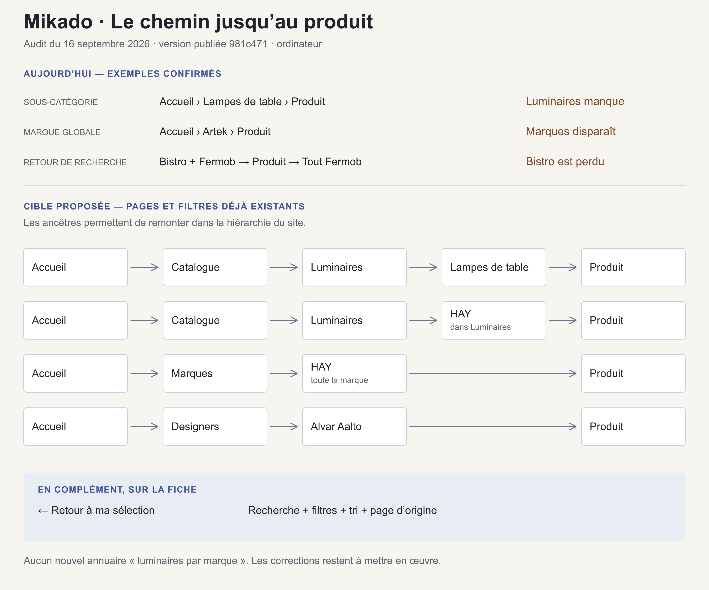

# Audit du fil d’Ariane Mikado — 16 septembre 2026

**[Lire le bilan des corrections publiées](BILAN_CORRECTIONS.md)** · **[Lire le rapport initial complet](rapport.md)** · **[Lire le plan de correction](PLAN_ACTION.md)**

Le rapport comprend dix sections : couverture, parcours actuels, points corrects, neuf constats détaillés, schéma cible, carte des familles, plan d’action, coordination avec l’importer, critères de validation et preuves.

## Consulter les documents

- [Rapport complet, lisible directement sur GitHub](rapport.md).
- [Plan de correction avec critères de clôture](PLAN_ACTION.md).
- [Schéma en image PNG](schema.png) et [version vectorielle SVG](schema.svg).
- [Rapport HTML autonome](rapport.html) : utiliser le téléchargement du fichier sur GitHub, puis l’ouvrir dans un navigateur ; le schéma est intégré au fichier.
- [209 adresses contrôlées](routes.csv), [123 URL représentant 103 produits](produits.csv), [13 parcours observés sur ordinateur](parcours-visuels.csv) et [203 simulations des règles](regles.json).

Ce dossier documente l’audit de la version publiée `981c471`. Les corrections du site ont ensuite été publiées ; leur couverture et les dépendances restantes sont détaillées dans le bilan. La disponibilité des 162 collections a été contrôlée ; les fiches ont été vérifiées par échantillonnage. Les limites détaillées figurent dans la première section du rapport.
